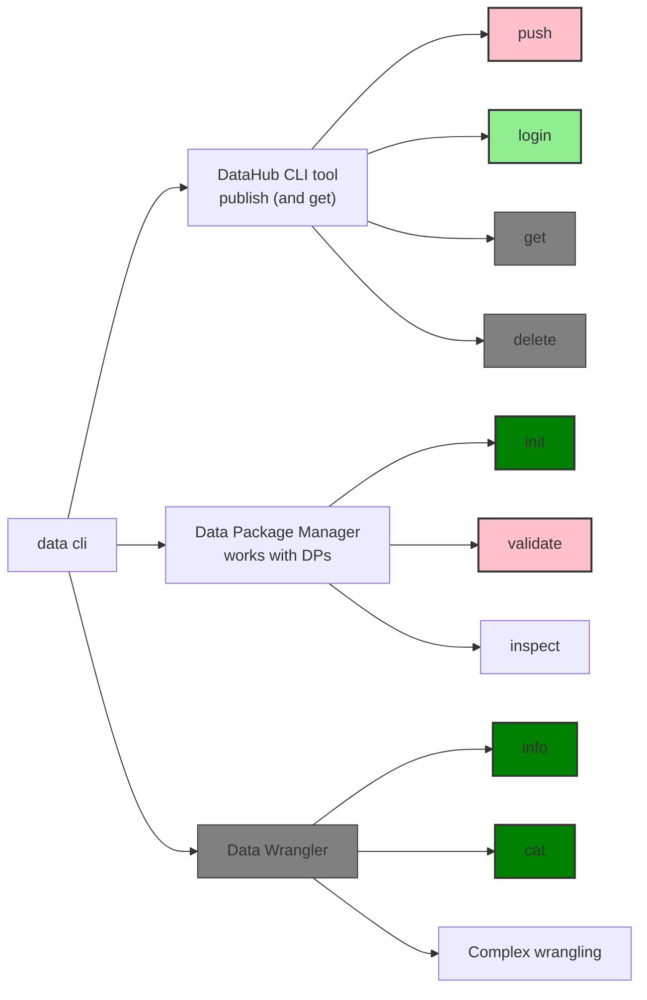
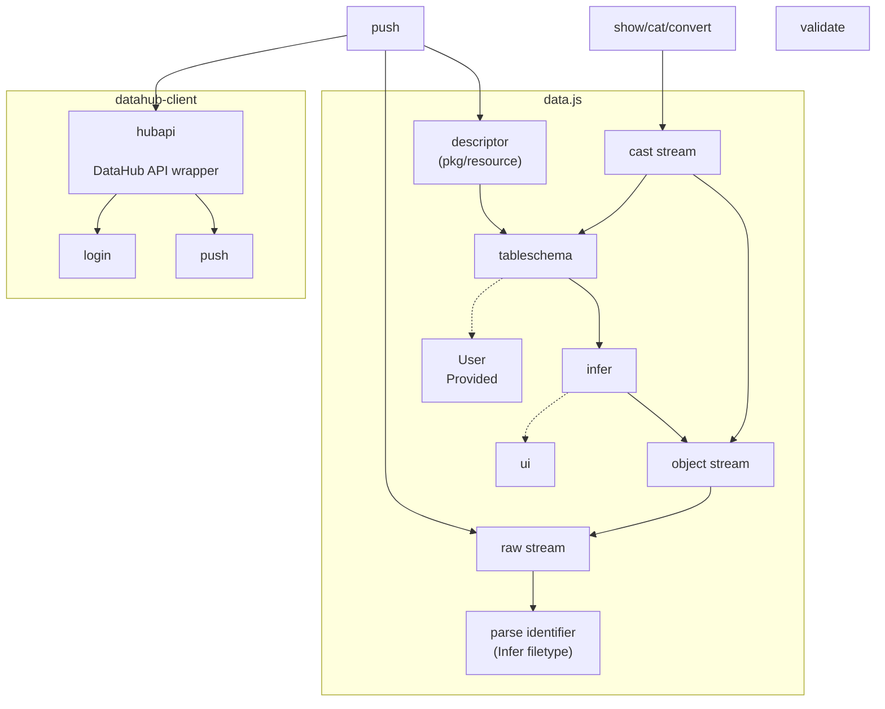
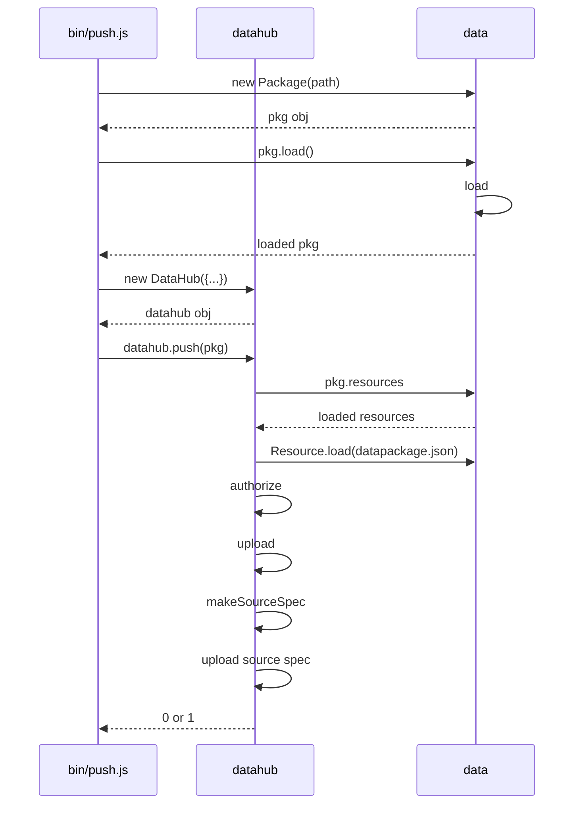
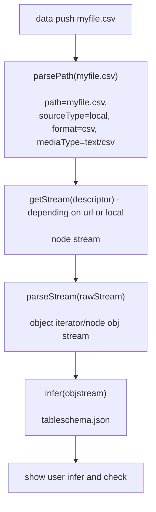

# Design of `data`

**Note: this material is from 2017-2018**

# What is the `data` tool

The `data` tool performs 3 complementary tasks:

* Data Publishing: it is the **DataHub command line interface** with support for pushing and getting data from the DataHub
* Data Packaging: it is a command line **Data Package manager** for creating, inspecting, validating and accessing data packages and their resources
* Data Wrangling: it is a lightweight command line **Data Wrangler tool** performing tasks like inspecting and cat'ing data files.

Illustrative set of commands

```bash
# =====
# Publishing

# data publishing
data push FILE
data push DIRECTORY

# get a file (from DataHub)
data get FILE / URL

# delete a published dataset
data delete

# =====
# Packaging

# create a data package
data init

# validate a data package
data validate

# =====
# Wrangling

# data (pre)viewing and conversion
data cat FILE
# data conversion
data cat FILE OUTFILE

# DIR: data package summary (assumes it is a data package)
# FIlE: print out meta and stream a summary of data (can turn off maybe in future with --no-preview)
data info {FILE-or-DIR}
```

**Overview diagram**

State of feature is indicated:

* light green = working well
* pink = working but needs work (and is priority)
* pink dashed = does not exist and priority
* green = exists and needs work but not priority
* grey = does not exist and not a priority



Why do we have 3 features in one:

* Doing push requires a lot of other stuff including the data package lib and (some) data wrangling (see diagram in next section)
* To encourage people to use the data tool for itself not just for the DataHub. (But: people have lots of other tools - do they need another one?)

Question: should we focus the tool just on the DataHub part (plus some Data Packages)?

* In general we focus on MVP right now (remove what is not essential!)
  * => drop the data wrangling stuff (?)
* However, we actually need most of this and it is useful to have some of this to hand (but be careful about feature creep)

## Doing `push` requires lots of the other stuff

This diagram shows what is involved with doing a push



For more on data.js Library - See https://hackmd.io/CwZgnOCMDs0LQEMAckBMdSsnMAjaIcADKgKYBmArGOSACbRJhA==?both


# What is wanted (user perspective)

[DataHub] *As a Publisher I want to*

1. Push / publish a local file: data push {file}
2. Push / publish a remote url: data push {url}
3. Push / publish a data package: ...
4. Get a data package, modify and republish (?)
5. Add a view

These are in priority order.

[Data Packager] I want to

* create a package with data files
* validate a data package or file
* inspect data packages
* read a resource (cast) 

[Wrangler] I want to

* inspect data files quickly (size, type etc)
* convert them ... e.g. xls -> csv, csv -> json

## An imagined session

```bash
# search around for datasets

# I found some csv or excel or even pdf - great! I want to see if useful
data cat URL

# or maybe just get some info on it e.g. its size, last updated
data info URL

# let's download it to inspect more ...
data get url

data cat file

# hmm - it will need some cleaning up.

# time to make some notes ...
vi README.md

# or maybe i just want to save this file online now ...
data push file

# more expert users may want to creata data package first ...
data init
data push
```

# Operations

## `push`


```bash
# create a dataset with this file (auto-generate)
data push myfile.csv

# what about specifying the dataset target
data push myfile.csv my-existing-dataset

# or with username
data push {myfile.csv} @myname/xyz

# or prompt for the dataset name
data push myfile.csv

> Dataset name: my-ram-xyz
> Dataset title: ...

If a dataset already exists
# TODO: what if we prompt for file name from user and it is the same as an existing dataset

# we can store this somewhere ...
.datahub/config
  default=myname/mydataset

data push --dataset=xyz/name myfile.csv -- replaces the file

# replaces the schema
data push --dataset=name --schema myschema.yaml

# updates the schema
data push --dataset=name --schema myschema.json
  
# fetches the schema
data get --dataset=name --schema --format=yaml


data push x [to y]
data push myfile.csv [{dataset}]

# what could be a problem

data push myfile1.csv myfile2.csv [{dataset}]

dataset = [user/]name
```


As a Publisher i want to publish a file and create a new dataset

```
data push myfile.csv [dataset-name]
```

As a Publisher I want to replace a file in an existing dataset

As a Publisher I want to add a file to an existing dataset

```
# if existing file with path myfile.csv or name myfile then we replace
data push myfile.csv dataset-name

# if existing file with name existing-file then we replace, otherwise we add as `existing-file`
data push myfile.csv dataset-name:existing-file

# if existing file exists so this would replace WARN the user ...
data push myfile.csv dataset-name
```

As a Publisher I want to delete a file from an existing dataset

```
data strip dataset-name[:file-name]
```


### data push {file} - Push / publish a local file: 

```
✓   data push some.csv
✓   data push some.xls
✓?  data push some.xlsx
✓?   data push a-random-file.xxx
✓?  data push some.pdf   // like a random file ...
✓?  data push some.png   // does it get viewed ...

✓?  data push some.zip  // inside are files => should act like pushing a directory?

=> should create data package with just README and no resources
data push README.md (?)

data push datapackage.json (?)

data push file1.csv file2.csv (?)
data push somefile.parquet
```

* Do we guess media type
* Do we add hash
* Do we prompt for file title
* Do we validate before pushing
* Do we add file size

### Issues

* No progress bar on upload
* No updates about what is happening on a push (we could update on each step successfully completed)
* We should skip re-uploading a file to rawstore if already uploaded
  * TODO: does rawstore tell us this atm?
* no support for data push and complex flows and flows involving automation
  * Could we automate creating the flow.yml?

2017-12-26 pushing to https://datahub.io/rufuspollock1/world-wealth-and-income-database/v/1 says at the top "Your data is safely stored and is getting processed - it will be here soon!" BUT I can already see a page (after a scan i do realise no files are there but that's sort of weird) and there is no other update information. Looking in JS debug i find:

```
Uncaught (in promise) TypeError: Cannot read property 'forEach' of undefined
    at https://datahub.io/static/dpr-js/dist/bundle.js:69:10210
    at r (https://datahub.io/static/dpr-js/dist/bundle.js:43:6760)
    at Generator._invoke (https://datahub.io/static/dpr-js/dist/bundle.js:43:7805)
    at Generator.e.(anonymous function) [as next] (https://datahub.io/static/dpr-js/dist/bundle.js:43:6939)
    at r (https://datahub.io/static/dpr-js/dist/bundle.js:50:5810)
    at https://datahub.io/static/dpr-js/dist/bundle.js:50:5912
    at <anonymous>
```


2017-12-23 try pushing a data package with just a readme (not even a datapackage.json) and check whether it works (why? I'd like to push research datasets where i'm still in the process of digging stuff up)

## `get`

### Issues

2017-12-23 data get command hung on me and I can't debug ... (no debug flag)  => I looked into adding this but introducing debug per command is a pain (we do it once by hand atm for push) => it should be systematic => refactoring dispatch code in the cli (and maybe therefore into the datahub-lib code ...)

data get command should have option to pull "remote" resources to local paths ...

2017-12-23 (?) data get command should pretty print the datapackage.json

## `login`

Login is working

## `cat`

...

## `init`

### Issues

data init guesses types wrong e.g. for world 
incomes database.

2017-12-26 data init does not add a license field by default

## `validate`

### Issues with data validation

* Does not run offline as errors on failure to access a profile (who cares about profiles by default - 99% of what i want to check is the data ...)

## `info`

```
For FILE:

{file-path}
size: ..
md5: ...
format: ...
encoding: ...

{PREVIEW}

data info 

```

## `delete` / `purge` / `hide`

As Publisher I want to delete a dataset permanently so it does not exist

```
data purge dataset-name

# prompt user to type out dataset name to 


# TODO: since people look for delete do we want to explain you hide the dataset
??
data hide
data unpublish
data delete # respond with use data push --findability ...
```

# Push File - Detailed Analysis

Levels:

0. Already have Data Package (?)
1. Good CSV
2. Good Excel
3. Bad data (i.e. has ...)
3. Something else

```
data push {file-or-directory}
```

How does data push work?

```
# you are pushing the raw file
# and the extraction to get one or more data tables ...
# in the background we are creating a data package + pipeline
data push {file}

Algorithm:

1. Detect type / format
2. Choose the data (e.g. sheet from excel)
3. Review the headers
4. Infer data-types and review
5. [Add constraints]
6. Data validation
7. Upload
8. Get back a link - view page (or the raw url) e.g. http://datapackaged.com/core/finance-vix
  * You can view, share, publish, [fork]

1. Detect file type
 => file extension
  1. Offer guess
  2. Probable guess (options?)
  3. Unknown - tell us

1B. Detect encoding (for CSV)

2. Choose the data
  1. 1 sheet => ok
  2. Multiple sheets guess and offer
  3. Multiple sheets - ask them (which to include)

2B: bad data case - e.g. selecting within table

3. Review the headers
  * Here is what we found
  * More than one option for headers - try to reconcile
  *


### Upload:

* raw file with name a function of the md5 hash
  * Pros: efficient on space (e.g. same file stored once but means you need to worry about garbage collection?)
* the pipeline description: description of data and everything else we did [into database]

Then pipeline runs e.g. load into a database or into a data package

* stores output somewhere ...

Viewable online ...

Note:
data push url # does not store file
data push file # store in rawstore

### BitStore

/rawstore/ - content addressed storage (md5 or sha hashed)
/packages/{owner}/{name}/{tag-or-pipeline}
```


Try this for a CSV file

```
data push mydata.csv

# review headers

# data types ...


Upload

* csv file gets stored as blob md5 ...
* output of the pipeline stored ...
  * canonical CSV gets generated ...
```


Data Push directory

```
data push {directory}

# could just do data push file for each file but ...
# that could be tedious
# once I've mapped one file you try reusing that mapping for others ...
# .data directory that stores the pipeline and the datapackage.json
```


## Push File - Sequence Diagram

CLI architecture



### Analysis

What are the components involved ...?



# Appendix: Notes on NodeJS streams

https://www.bennadel.com/blog/2692-you-have-to-explicitly-end-streams-after-pipes-break-in-node-js.htm

https://gist.github.com/spion/ecdc92bc5de5b381da30

https://github.com/maxogden/mississippi <-- recommended for managing node streams in consistent ways
